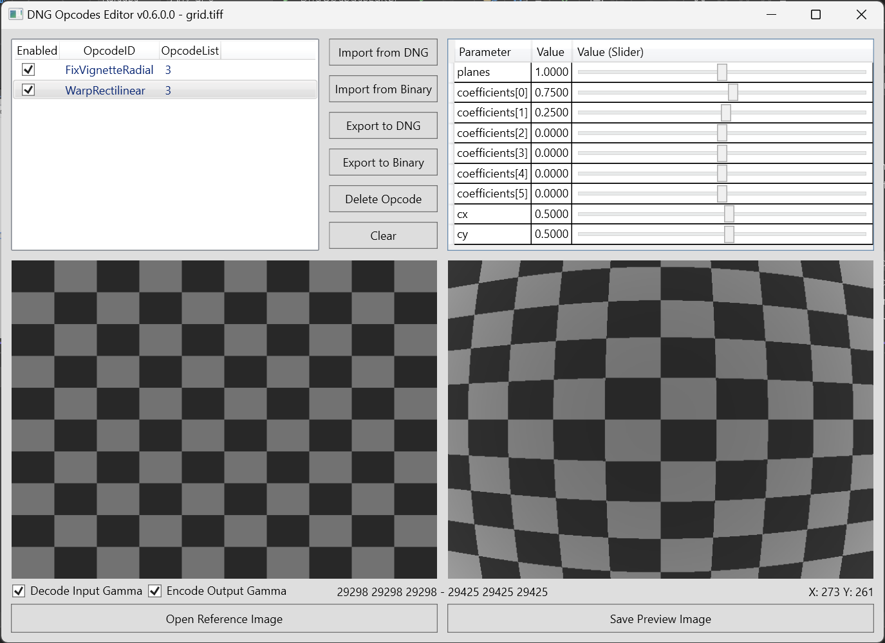

# Dng Opcodes Editor

Dirty WIP Fork of (https://github.com/electro-logic/DngOpcodesEditor)

Additionally to the original functionality, there are 2 more Buttons in the UI.

"Batch DNG Gainmap" allows the selection of multiple dng files. By default the dng vignette correction metadata will be stripped of its luminance component. Check "Keep Luminance" otherwise. Also gainmap mismatch for BGGR and GRBG CFA Sensors are available by their respective checkboxes. Enabling "Keep Luminance" without mismatch fixes will not start the conversion, because nothing would be changed inside the dngs

"Batch White Image" allows reading a white image dng and exporting a version with luminance stripped for use in Raw Therappe. This will only work with dngs that have a black level of 0. Anything above that will lead to miscorrections. Afterwards you can select a dng sequence where the luminance stripped white image will be applied to. If you want to also apply the Luminance Correction to the dngs, check "Keep Luminance". By default all intermediate files are deleted. Enable "Keep Intermediate Files" to see the conversion steps for both white image and converted dngs.

These Features are very slow and ressource inefficient. Expect Issues and Crashes. Maybe restart your PC and do not access the files via Windows Explorer. 
There is no Progress Bar. Execute from IDE for Progress Notice in Console. 

Additionally to exiftool, dcraw.exe binary is included to extract raw data tiff from dngs and Adobe SDK dng_validate.exe binary is included to validate input dngs and author output dngs.

Opcodes parameters can be freely changed to see the effect on the image in real-time.

Supported opcodes:

- FixVignetteRadial
- WarpRectilinear (single plane only, based on the Brown-Conrady distortion model)
- TrimBounds
- GainMap (preliminary implementation)

Required Software:

- [.NET Desktop Runtime 6](https://dotnet.microsoft.com/en-us/download/dotnet/6.0)
- [ExifTool](https://exiftool.org)

Useful links:

- [DNG 1.7.0.0 Specification](https://helpx.adobe.com/camera-raw/digital-negative.html)
- [LibRaw](https://www.libraw.org)

Notes:

- This project is not an official DNG Tool and may not be fully compliant with DNG Specifications.
- Metadata reading/writing is based on ExifTool. Thank you Phil!
- Open an issue if you need a specific opcode implemented
- Export to DNG writes the OpcodeList3 tag only. You may need to write IFD0:OpcodeList3 if SubIFD is not defined in your DNG files.
- FixVignetteRadial may require adjusting the strenght in some RAW processors (ex. Capture One)

F.A.Q:

**- Can I open a DNG image?**

No, you can only import Opcodes from a DNG file. To Open a DNG image, the file should be developed first.
You can develop the file in a minimal way by using the LibRaw utility dcraw_emu with the following command:

dcraw_emu.exe -T -4 -o 0 input.DNG

The command produces a demosaiced linear TIFF image (16 bit) that can be opened as a Reference Image.

**- Why the preview is too bright/dark?**

Because opcodes are designed to work before the gamma encoding.
If the reference image is gamma encoded check the "Decode Input Gamma" option, uncheck otherwise.
The "Encode Output Gamma" option should be always checked to properly display the preview image.

**- Why I can't see the preview image I saved?**

Ensure that your image viewer supports 16 bit TIFF files
